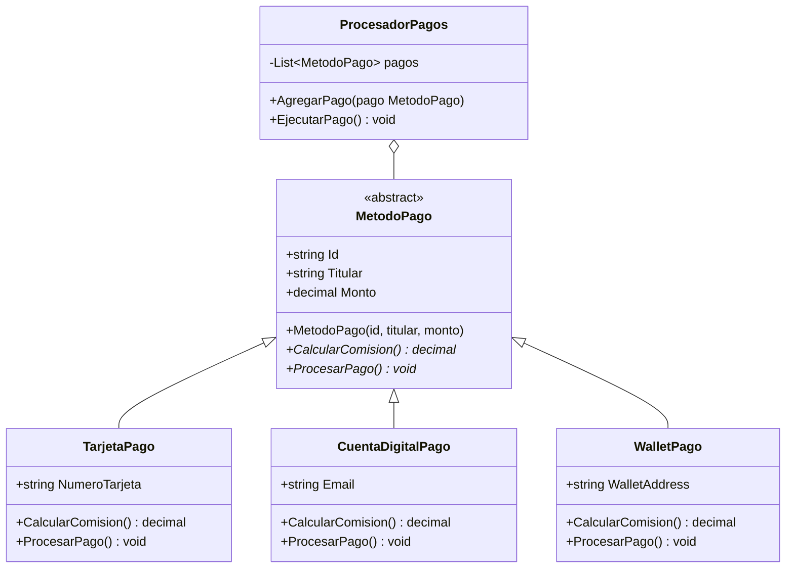

# Sistema de Pagos Multicanal

---
Este repositorio es un laboratorio técnico diseñado para profundizar en C# .NET.

## Descripción
Este proyecto busca orquestar pagos de distintos medios tales como tarjetas, cuentas digitales y wallets(cripto-monedas).

## Arquitectura
En esta sección se definira de manera superficial la arquitectura que tendra este proyecto.

### Diagrama de Clases

